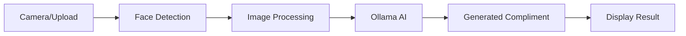

<!-- Title Banner -->
<div align="center">
  
# 🌟 Compliment-AI 🤖

[](https://www.python.org)
[](https://ollama.com)
[](https://opencv.org)
[](LICENSE)

*Boost your day with AI-powered compliments! ✨*

[Features](#features) • [Installation](#installation) • [Usage](#usage) • [Demo](#demo) • [Contributing](#contributing)


</div>

## 🎯 Features

- 📸 Real-time webcam integration
- 🎨 Modern GUI interface
- 🔍 Advanced face detection
- 📤 Image upload support
- 💫 AI-powered compliment generation
- 🎵 Smooth user experience

## 🚀 Installation

### Prerequisites

- Python 3.8 or higher
- Webcam (for live capture)
- Ollama installed locally

### Quick Start

```bash
# Clone the repository
git clone https://github.com/callmeianwu/compliment-ai.git
cd compliment-ai

# Install dependencies
pip install -r requirements.txt

# Run the application
python main.py
```

## 📖 Usage

1. **Start the App**
   ```bash
   python main.py
   ```

2. **Choose Your Input**
   - 📹 Click "Start Camera" for live webcam
   - 📁 Click "Upload Image" for existing photos

3. **Get Your Compliment**
   - 🎬 For webcam: Strike a pose and click "Capture/Analyze"
   - 🖼️ For uploads: Select your photo and click "Analyze"

## 💡 How It Works



## 🛠️ Tech Stack

- **Frontend**: Tkinter
- **Image Processing**: OpenCV
- **AI Model**: Ollama 7B
- **Face Detection**: Haar Cascade Classifier

## 🎨 Features in Detail

| Feature | Description |
|---------|-------------|
| 📸 Live Capture | Real-time webcam integration with face detection |
| 🖼️ Image Upload | Support for existing photo analysis |
| 🤖 AI Processing | Advanced compliment generation using Ollama 7B |
| 👥 Face Detection | Accurate facial feature recognition |
| 🎯 User Interface | Clean, modern GUI design |

## 🌈 Demo

<div align="center">
  
  
  *AI-powered compliments in action!*
</div>

## 🤝 Contributing

Contributions are what make the open-source community amazing! Any contributions you make are **greatly appreciated**.

1. Fork the Project
2. Create your Feature Branch (`git checkout -b feature/AmazingFeature`)
3. Commit your Changes (`git commit -m 'Add some AmazingFeature'`)
4. Push to the Branch (`git push origin feature/AmazingFeature`)
5. Open a Pull Request

## 📜 License

Distributed under the MIT License. See `LICENSE` for more information.

## 🙏 Acknowledgments

- Ollama team for their amazing AI model
- OpenCV community
- All contributors and supporters

<div align="center">

---

### Made with ❤️ and Python

[](https://github.com/yourusername)
[](https://github.com/yourusername/compliment-ai)

</div>